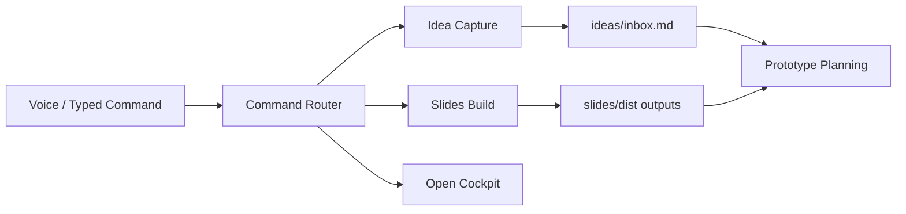

# NOIZY DreamChamber Interface

Voice-first command center for `NOIZY.AI` creation workflows.

## Interface Objective

Provide one surface where a creator can:

1. Capture ideas by voice
2. Convert ideas to deck artifacts
3. Launch prototype workflows
4. Route commands safely with minimal typing

## Interface Zones

### 1) Command Rail

- Primary intents:
  - `capture idea <text>`
  - `export slides pptx|pdf|html`
  - `watch slides`
  - `open cockpit`
  - `open aquarium`
  - `join as composer <name>`
  - `promote to noizykidz teacher <name>`
  - `list composer guild`
  - `list noizykidz teachers`
- Routed through allowlisted command map.

### 2) Idea Stream

- Live source file: `ideas/inbox.md`
- Timestamped entries become backlog for build/pitch docs.

### 3) Build Rail

- Deck source: `slides/deck.md`
- Exports: `slides/dist/`
- Scripted from VS Code tasks and npm commands.

### 4) Prototype Rail

- Local service prototypes and demos
- Includes self-hosted `noizy_platform` API scaffold for AVA, composer guild, and pipeline services.

## System Diagram

## Safety Rules

- No arbitrary shell execution.
- Only commands in `workstation/commands.json` can run.
- Unknown intents return suggestions.

## Next Integration Targets

1. Whisper transcript hook -> command router input
2. Connect Aquarium homepage live feed to `aquarium_state.json`
3. Wire `noizy_platform` endpoints into DreamChamber prototype rail
