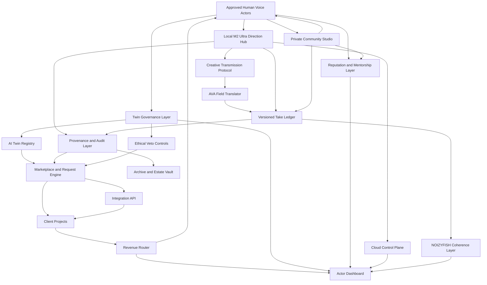
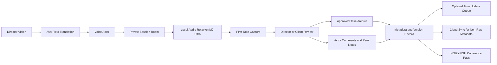
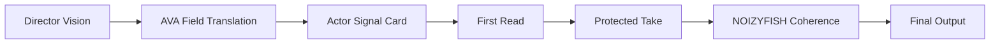
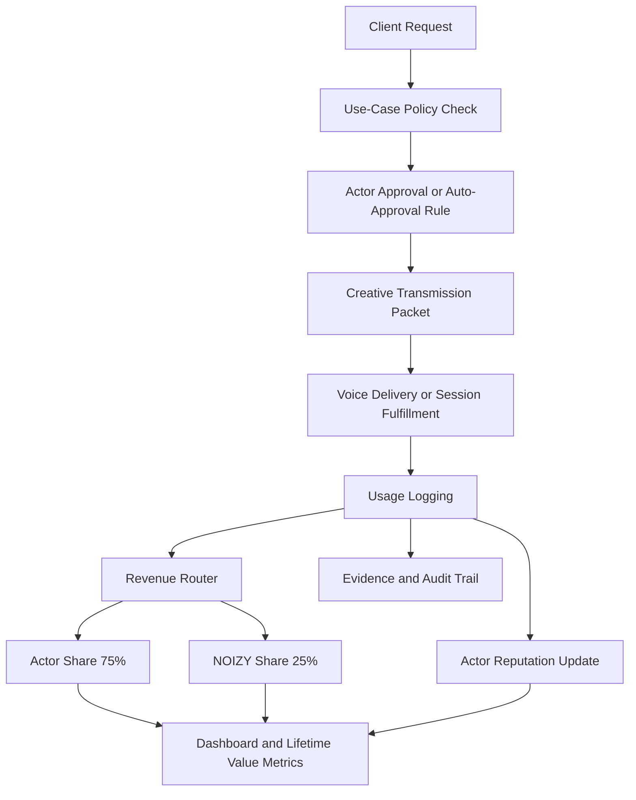

# Sovereign Voice Ecosystem Blueprint

## Summary

This is the visual and structural blueprint for the NOIZY Sovereign Voice Collective.

It translates the product idea into a system that can be shown to:

- voice actors
- collaborators
- technical partners
- investors

Companion local session spec:

- [sovereign-voice-local-direction-hub.md](./sovereign-voice-local-direction-hub.md)
- [noizyvox-frequency-transmission-blueprint.md](./noizyvox-frequency-transmission-blueprint.md)

## Core Position

NOIZY is not building a generic voice clone marketplace.

It is building a creator-governed voice ecosystem where:

- the human voice actor is the source of authority
- the AI twin is governed by that source
- usage is permissioned
- payouts are transparent
- community collaboration increases the value of the network

## System Promise

The network is not just a library.

It is a managed creative economy where:

- human voice actors remain the source
- versioned voice assets remain traceable
- live direction remains private and high-fidelity
- community reputation compounds value
- integrations stay policy-aware
- direction behaves like signal transmission rather than over-control

## Ecosystem Diagram

## Local Direction Hub

The M2 Ultra can operate as the local-first performance center.

Its role is not just compute.
Its role is control.

### Hub Functions

- receive private real-time audio sessions
- default to actor-to-director routing only
- route actor audio only to the director or approved session peers
- create an optional listen-only client monitor feed
- monitor latency and session quality
- record approved takes to local storage
- trigger review, tagging, and archive workflows
- keep raw performance capture under platform-controlled privacy rules
- prepare clean handoff to dashboards, marketplace workflows, and governed APIs
- protect first-take captures as distinct session artifacts

### Design Principle

The hub should feel like a private studio relay, not a public livestream tool.

The local machine is not just a recorder.
It is the performance gate, archive boundary, and direction surface.

## Live Session Flow

## Frequency Transmission View

## Human Governance Model

### Actor Approval

NOIZY approves humans first.

That means:

- identity verification
- studio and recording standards
- contract acceptance
- ethics and use-case preferences
- profile creation

### Twin Governance

Each actor controls:

- allowed verticals
- blocked verticals
- pricing rules
- approval thresholds
- training consent scope
- retirement and beneficiary rules

### Community Layer

The private studio community should support:

- actor feedback loops
- peer reviews
- timestamped notes on takes
- mentorship
- collaborative interpretation
- prestige and recognition without removing sovereignty

### Creative Transmission Layer

The system should help a director transmit a field, not just a script note list.

That means:

- emotional framing
- narrative containers
- sensory anchors
- first-take protection
- minimal redirect loops
- coherence after capture, not generic flattening before capture

### Reputation Layer

Recognition should reflect:

- review quality
- responsiveness
- client satisfaction
- mentorship contribution
- policy completeness

This should create prestige without turning the network into a race-to-the-bottom contest.

## Rights and Money Flow

## Integration Surface

The commercial edge of the system should include a governed API for:

- indie creator tools
- game and animation pipelines
- agency request intake
- dubbing workflows
- premium custom booking

Every integration should be checked against actor policy, pricing rules, and approval thresholds before fulfillment.

## Product Layers

### 1. Source Layer

- human voice actor profiles
- identity and trust verification

### 2. Performance Layer

- live sessions
- upload and review
- versioned takes
- community studio rooms
- first-take capture

### 3. Twin Layer

- governed AI twin
- consent-scoped training
- restricted use matrix

### 4. Creative Transmission Layer

- AVA brief translation
- signal cards
- first-take protection
- NOIZYFISH coherence pass

### 5. Community Layer

- mentorship
- peer notes
- ethical trust badges
- prestige signals

### 6. Commercial Layer

- search and request workflows
- quote and approval routing
- project fulfillment
- governed API integrations

### 7. Trust Layer

- provenance
- audit trail
- usage logs
- evidence packs

### 8. Economic Layer

- split engine
- dashboards
- recurring income logic
- estate and legacy routing

## Why This Wins

### Against Generic Voice Platforms

- human authority remains visible
- ethical controls are productized
- actors keep real upside
- premium trust becomes the differentiator

### Against Traditional Voice Licensing

- actors gain recurring income instead of one-time licensing only
- clients get faster governed access
- high-quality custom work and AI-enabled work can coexist
- actors can run long-term studio businesses without surrendering the source

## MVP Build Order

1. Actor onboarding and approval flow
2. Twin governance schema
3. Local direction hub prototype
4. Creative transmission packet
5. Session version ledger
6. Request and approval workflow
7. Revenue dashboard and payout routing
8. Community review rooms
9. Integration API

## Next Actions

- define the actor profile schema
- define the twin policy matrix
- define the local session architecture
- define the director-only relay prototype
- define the actor signal card
- define the metadata sync boundary between local and cloud
- define the dashboard metrics
- define the client request lifecycle
- define the reputation model
