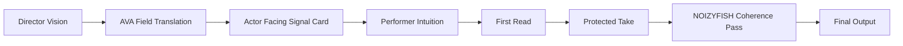
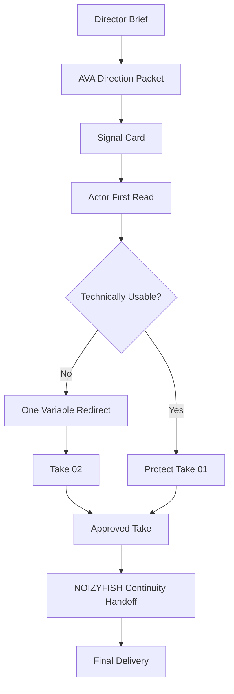
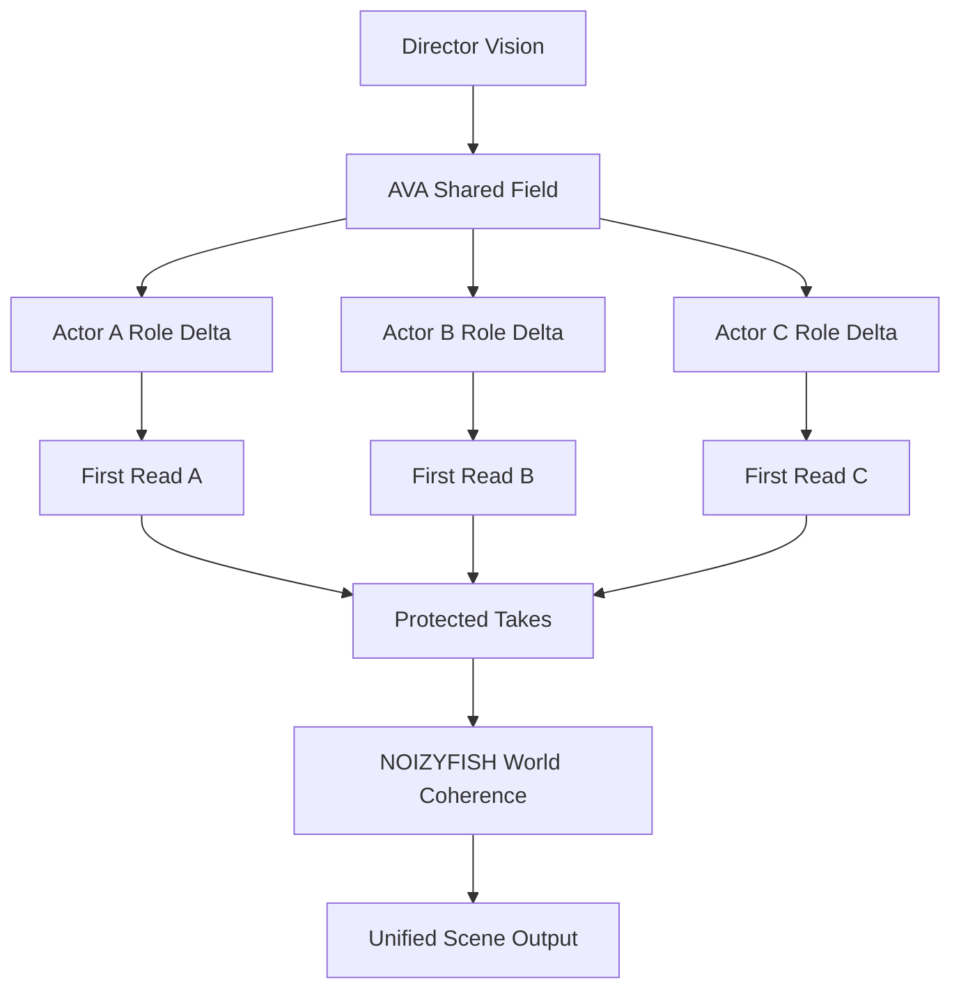
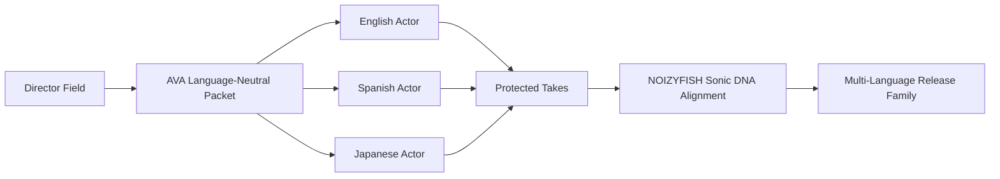
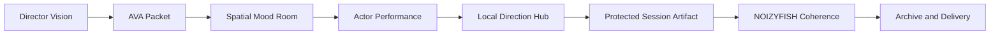

# NOIZYVOX Frequency Transmission Blueprint

## Summary

This is the visual systems map for NOIZYVOX as a frequency-transmission platform.

Use it when the team needs to understand how:

- a director's brief becomes a resonant field
- AVA scales that field across actors
- first reads stay protected
- NOIZYFISH keeps the output inside one sonic universe
- the system can work across voice, VR, and multi-language pipelines

This is the visual companion to:

- [resonance-principle.md](../01_PHILOSOPHY/resonance-principle.md)
- [creative-transmission-protocol.md](./creative-transmission-protocol.md)
- [ava-direction-packet-spec.md](./ava-direction-packet-spec.md)
- [sovereign-voice-network.md](./sovereign-voice-network.md)

## Core Thesis

Direction is not primarily instruction.

It is frequency transmission.

The director creates a field:

- emotional weather
- narrative pressure
- tonal boundary
- sensory image

The actor enters that field before the analytical layer starts over-correcting.

That is why the first read is often the keeper.

## Core Loop

## System Roles

### Director

Creates the original field:

- what the scene wants
- what must be felt
- what must not happen

### AVA

Clarifies and scales the field:

- compresses the brief
- preserves contradictions
- creates signal cards
- splits shared field from role-specific delta

### Performer

Embodies the field through:

- instinct
- breath
- craft
- emotional memory

### NOIZYFISH

Protects world continuity after capture:

- tonal identity
- environmental signature
- project-level sonic DNA

## Single-Actor Session Flow

## Multi-Actor Resonance Flow

This is the scale layer.

AVA should not give every actor the same note list.
It should hold one shared field while giving each actor a different pressure point.

## Multi-Language Transmission

The field should survive language change.

What travels across languages is not just wording.
It is:

- energy
- pacing
- intimacy distance
- danger
- restraint
- emotional weather

## VR And Spatial Layer

In VR or DreamChamber-linked production, the field can become spatial.

The actor is not only hearing notes.
They are entering an atmosphere.

## What Makes The First Read Valuable

- the actor has not drifted into self-correction yet
- the nervous system is still answering the field directly
- the contradiction inside the moment is still alive
- the performance is less explained and more inhabited

This is not a claim that later takes are useless.

It is a design rule:

- preserve the original transmission
- only redirect one variable at a time

## Packet Stack

The transmission stack should be:

1. Director brief
2. AVA direction packet
3. Actor-facing signal card
4. Protected first read
5. Minimal redirect notes
6. NOIZYFISH continuity handoff
7. Session manifest and archive artifact

## Why This Matters

Most AI voice systems focus on:

- cloning
- speed
- replacement

NOIZYVOX focuses on:

- transmission
- first-read truth
- source-governed performance
- scalable human direction

That is the differentiator.

## Build Implications

This blueprint implies the platform needs:

- a signal-card generator
- a direction-packet schema
- first-take protection in the local hub
- multi-actor shared-field logic
- multi-language packet preservation
- NOIZYFISH continuity targets in the session manifest

## Next Actions

- bind both to the local session manifest
- add shared-field and role-delta handling to multiplayer voice sessions
